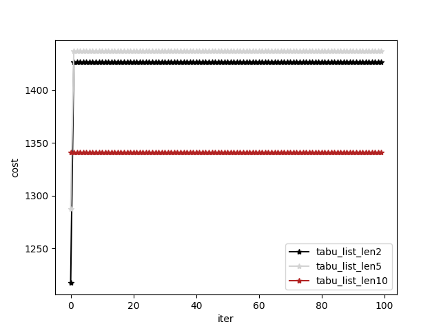

# heuristic algrithms for solving knapsack and uniform graph partitioning problem

This repo implements two heuristic algrithms, Simulated Annealing and Tanbu algorithm, to solve knapsack and uniform graph partitioning problems, respectively. 

Take the knapsack problem for example, you can choose one method between 'brute', 'SimulatedAnnealing' and 'TabuSearch' for solving the problem. 

```python
from knapsack import Knapsack
from simulated_annealing import SimulatedAnnealing
from tabu import TabuSearch
from brute import BruteSearch


if __name__ == "__main__":
    capacity = 750
    weights = [70, 73, 77, 80, 82, 87, 90, 94, 98, 
                   106, 110, 113, 115, 118, 120]
    values = [135, 139, 149, 150, 156, 163, 173, 184, 
                  192, 201, 210, 214, 221, 229, 240]
    knapsack = Knapsack(weights=weights, values=values, maxWeight=capacity)
    
    method = ['brute', 'SimulatedAnnealing', 'TabuSearch'][0]
    
    if method == 'brute':
        runner = BruteSearch(knapsack)
    elif method == 'SimulatedAnnealing':
        runner = SimulatedAnnealing(knapsack, max_iterations=20000, temp_max=500, temp_min=0.1**10, cold_ratio=0.999, neighbor_search_num=1)
    elif method == 'TabuSearch':
        runner = TabuSearch(knapsack, tabu_list_len=10, max_iterations=100, neighbor_search_num=1)
    
    runner.run()
```

The objective values can be recorded and saved in the folder `results`, and you can draw them by
```python
python draw_curve.py
```
For example, when I did an ablation study on the length of tabu list, I got


Any issues are welcomed!
